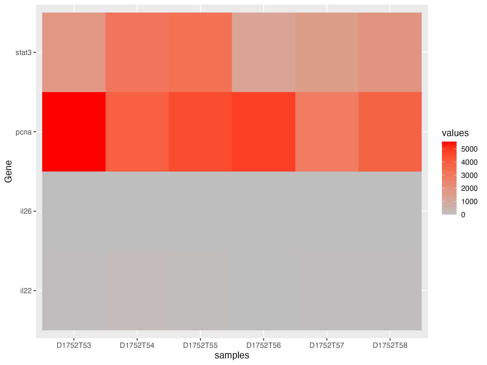
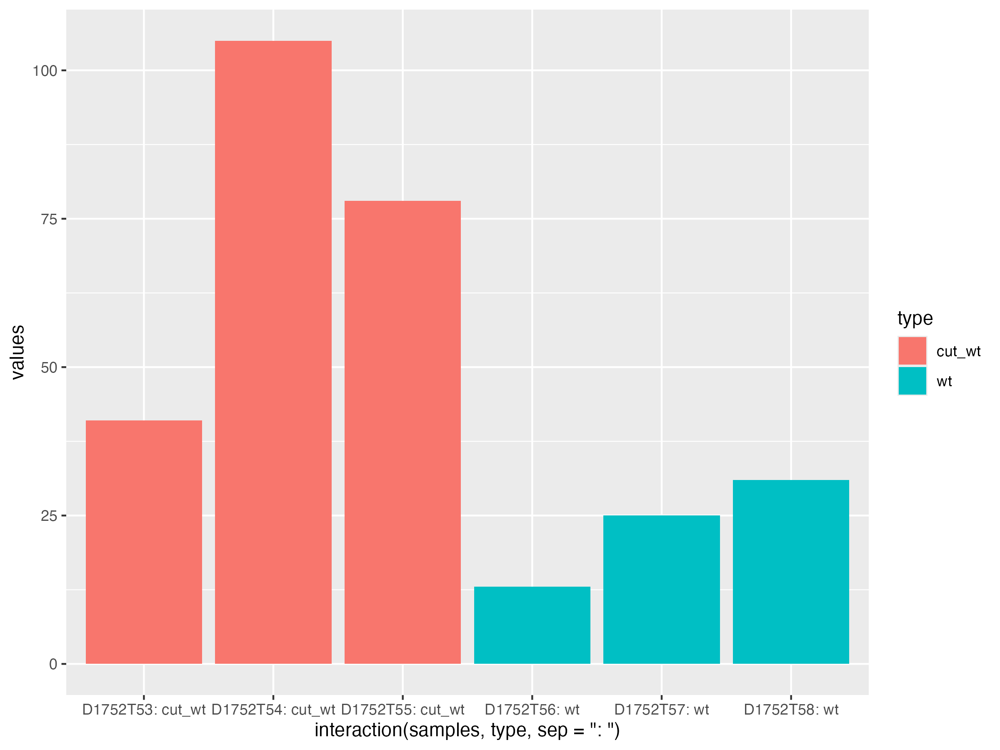
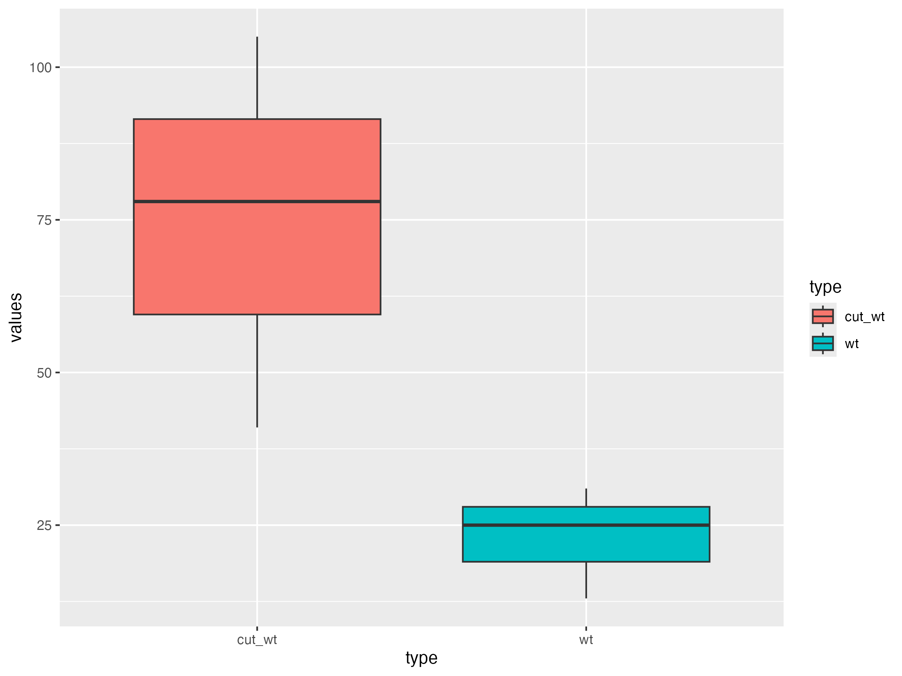
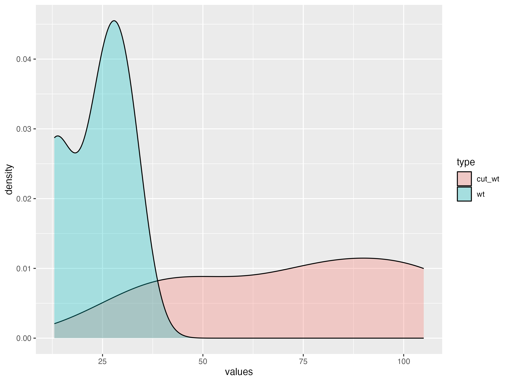
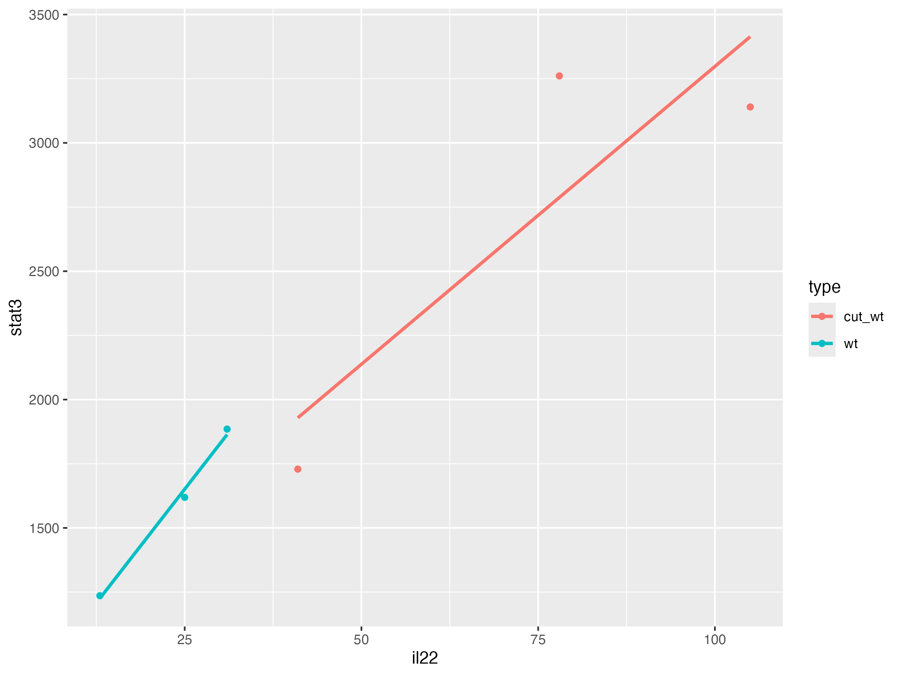

# Zebrafish Intestinal Regeneration Analysis

An R bioinformatics pipeline designed to analyze RNA-seq count data (`GSE338160`) and visualize gene expression patterns during zebrafish gut regeneration.

## Features:
- **Data Wrangling:** GEO metadata parsing and data reshaping using `tidyverse`.
- **Statistical Summaries:** Group-wise metrics for key target genes (`il22`, `il26`, `pcna`, `stat3`).
- **Visualizations:** High-resolution bar plots, density plots, box plots, gene-to-gene correlation scatter plots with linear trends, and heatmaps.

### 📊 Visualizations & Results

**Gene Expression Heatmap**

**IL-22 Expression Analysis**

**IL-22 vs STAT3 Correlation**

